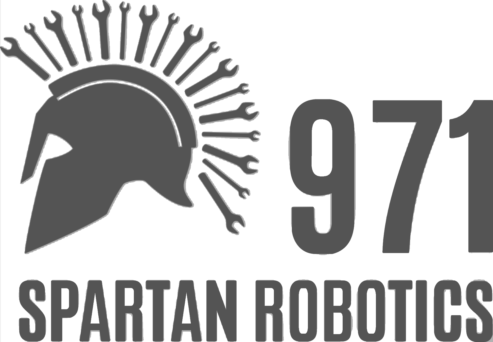
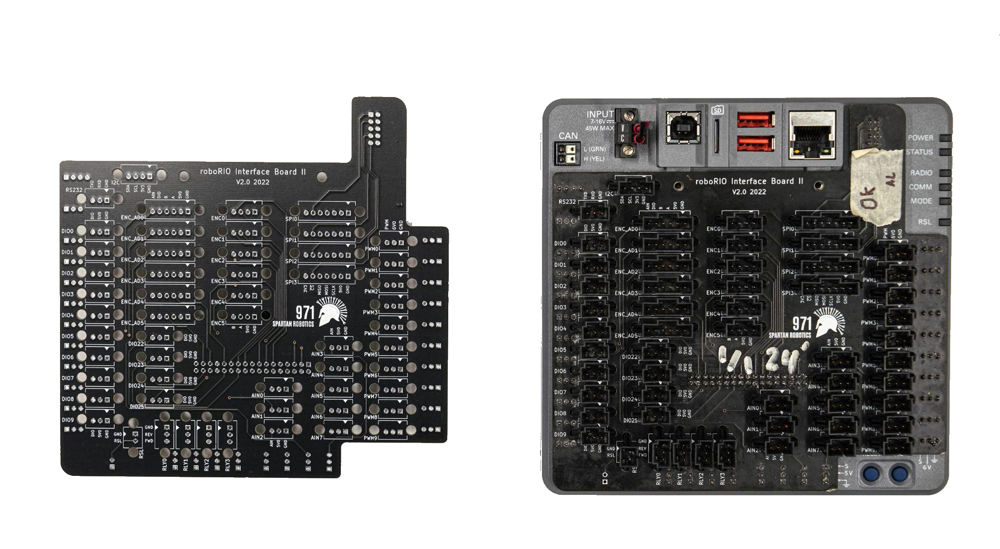
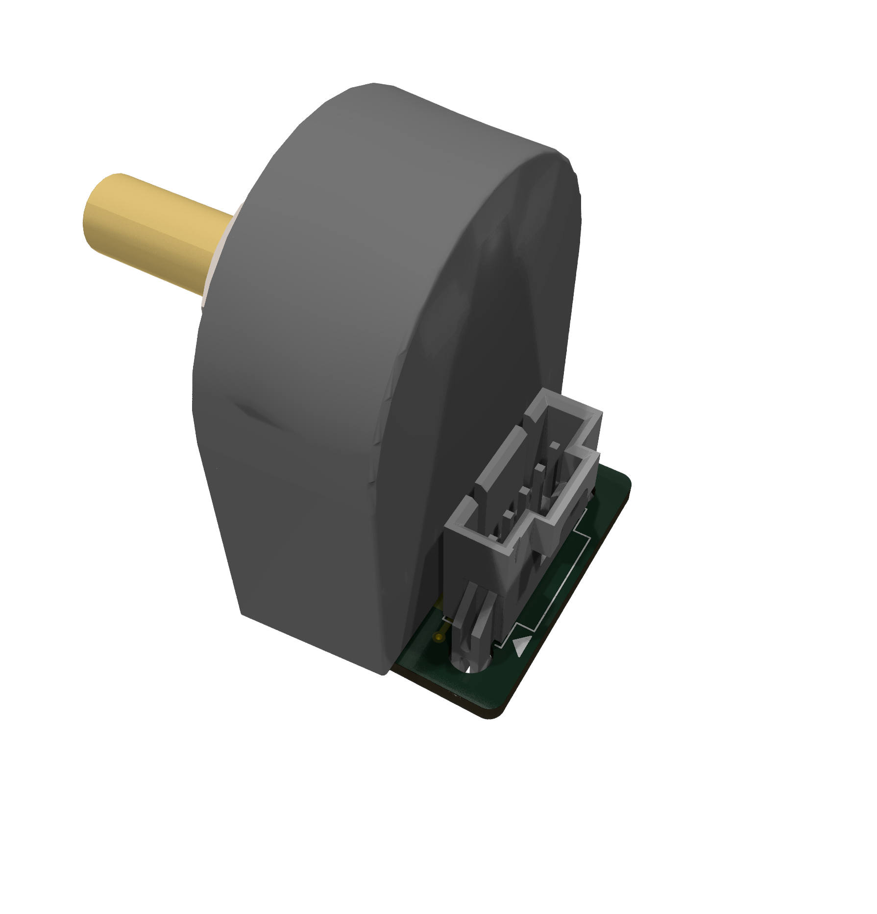
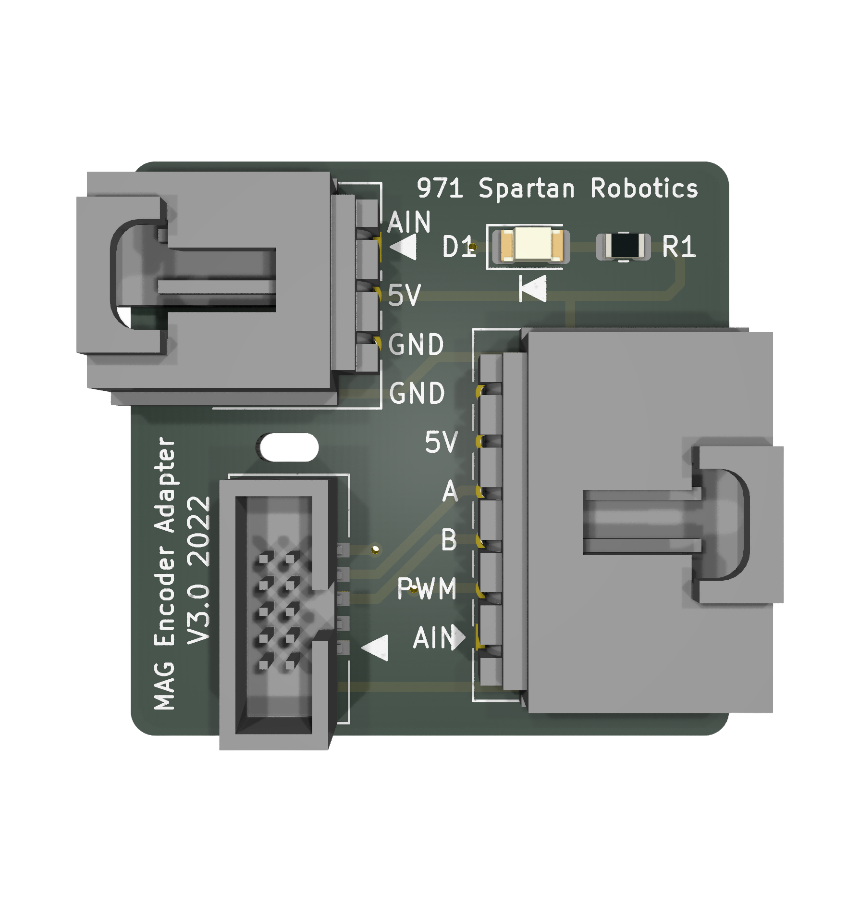
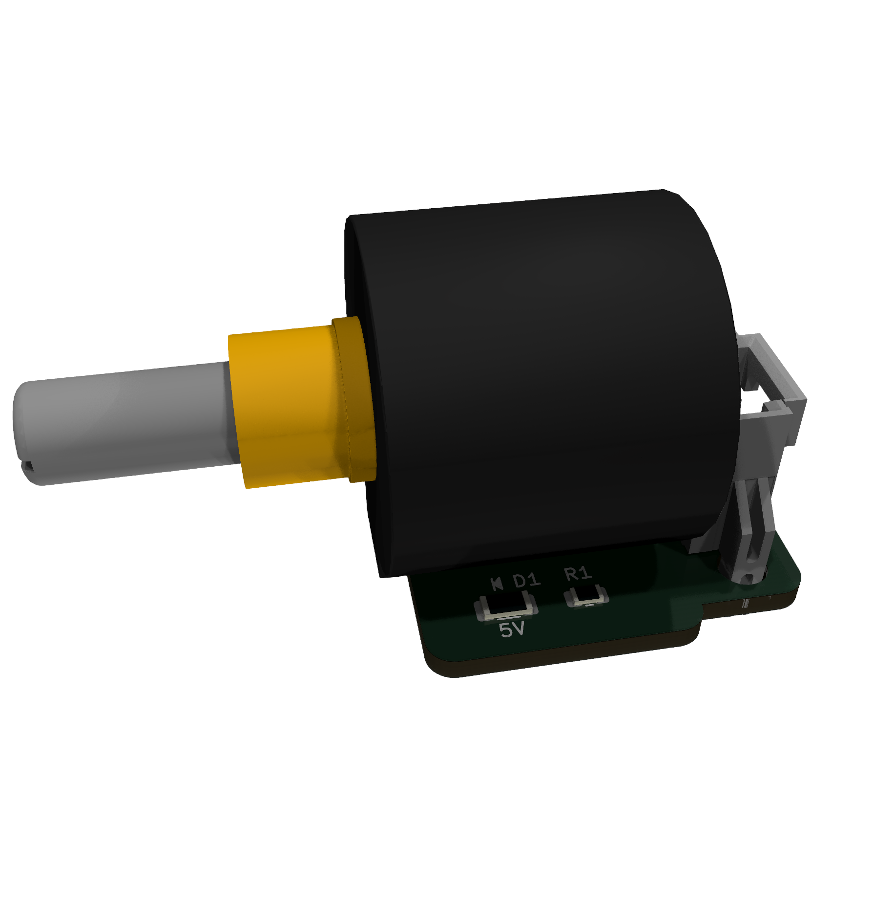
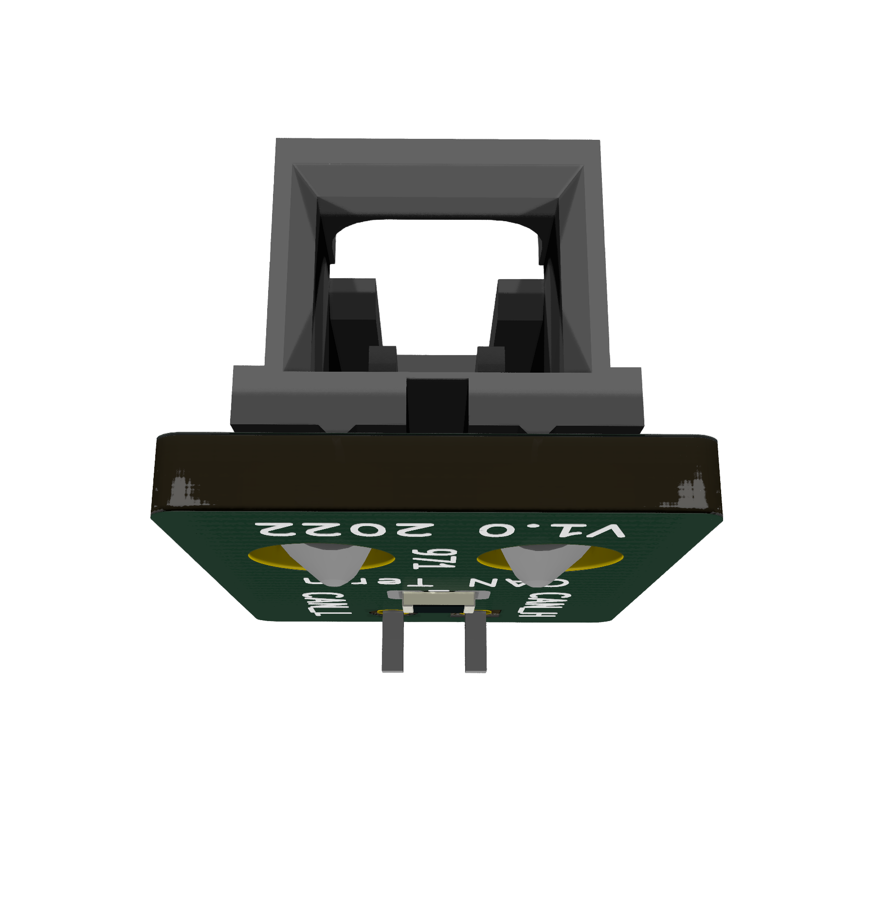
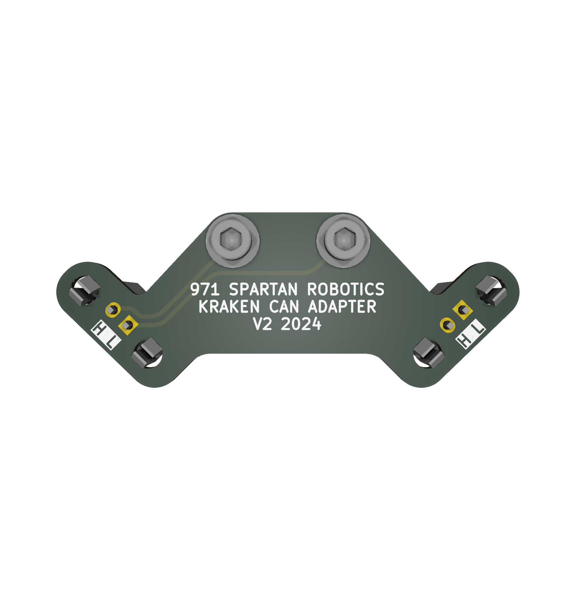

# PCB Catalog

Table Of Contents
1. Beam Break Board
    1.1. Features
    1.2. Specifications
    1.3. Applications
        ...1.3.1 Compatibility
2. Spartan Board
    2.1 Features
3. Encoder Adapter Board
    3.1 Features
4. Mag Encoder Adapter Board
    4.1 Features
5. Potentiometer Adapter Board
    5.1 Features
6. Can Terminator
    6.1 Features 
7. Mini Power Distribution Board
    7.1 Features
    7.2 Specifications 
        ........7.2.1 Rated Voltage and Current
8. Kraken CAN Connector Board
    8.1 Features
9. Closing Notes
    9.1 Resources
---
1. Beam Break Board

	1.1. Features
	* Interfaces industrial beam break sensors to the RoboRio
	* Utilizes optocoupler to increase signal integrity by preventing ground loops
	* Power and Signal LEDs to aid in user diagnostics
	* Single-sided design for easy mounting and fabrication
	
	1.2. Specifications
	* Active Low Output
	* 12V Power
	* Molex SL Connectors 
	1.3. Applications
	* Beam Break
	* Other sensors with similar active low (NPN) output signal
	
	    1.3.1. Compatibility
	    * Sensors or switching devices with similar Output to Automation Direct QMI7-0N-0F
	    * Most industrial switching devices from Automation Direct and similar distributors
	    * Compatible with Spartan Board
---

2. Spartan Board

	2.1. Features
	* Converts all RoboRio connections to latching Molex SL connectors
	* Quick and straightforward installation
	* Labeled Ports
	* All through-hole connectors for easy re-work/replacement and reliability
	* 13x Digital I/O ports
	* 8x Analog Input ports
	* 6x Quadrature Encoder Input Ports
	* 6x Combined Encoder, Analog Input, PWM Input Ports
	* 10x PWM Outputs
	* 4x SPI Ports
	* I2C Bus
	* RS232 Console
	* RSL Port

---
3. Encoder Adapter Board

	3.1. Features
    * Connects 5-pin optical encoder (US Digital [S1-512-250-IE-B-D](https://www.usdigital.com/products/encoders/incremental/shaft/s1/)) to a Molex SL connector 
    * Power indication LED 
    * Compatible with Spartan Board
---
4. Mag Encoder Adapter Board

	4.1. Features
	 * Connects 3-pin [3549S-1BA-102B potentiometer](https://www.digikey.com/en/products/detail/bourns-inc/3549S-1BA-102B/2534314) and 10-pin [CTRE mag encoder](https://store.ctr-electronics.com/srx-mag-encoder/) to a 6-pin Molex SL connector

    * Compatible with Spartan Board
    * Power indication LED 
---
5. Potentiometer Adapter Board

	5.1. Features
    * Connects 3-pin [3549S-1BA-102B potentiometer](https://www.digikey.com/en/products/detail/bourns-inc/3549S-1BA-102B/2534314) 3 to 10 turn potentiometers to a Molex SL connector 
    * Power indication LED 
    * Compatible with Spartan Board
---
6. Can Terminator

	6.1. Features
    *  120 Ohm CAN bus terminator using a Molex SL connector
---
7. Mini Power Distribution Board

	7.1. Features
	* LED lights up when a fuse is inserted. 
	* Replaceable fuses
	* Labeled connectors   
	
	7.2. Specifications
	* 12-24 AWG output WAGO connectors
	* 8-24AWG input WAGO connectors
	* [MINI® 297 fuses](https://www.littelfuse.com/products/fuses/automotive-passenger-car/blade-fuses/297.aspx)
	
	    7.2.1. Rated Current
	    * Max current is 10 amps per circuit
----
8. Kraken CAN Connector Board

8.1. Features
	* Molex SL connectors
	* Simplifies connecting Kraken motors to a CAN bus
---
9. Closing Notes
9.1. Resources
	* [GitHub](https://github.com/frc971/electrical)
	    * GitHub contains PCB files,3d files, and BOMs
 
